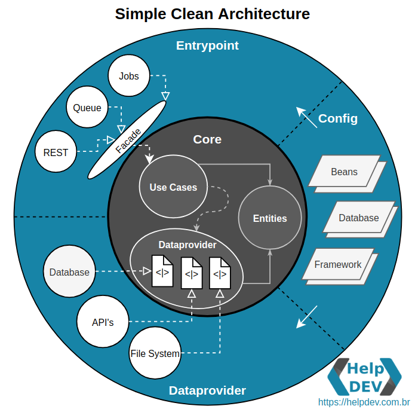

Com uma visão de arquitetura mais simplista, seguindo todos os bons conceitos, principalmente a de manter o isolamento total do core, mas com uma única camada externa para a aplicação, simulando uma divisão modular fisicamente por packages com config, entrypoint e dataprovider.

Para exemplificar um pouco mais o modelo baseado na Clean Architecture e Ports and Adapters, segue uma ilustração para visualização das dependências de cada camada e as ligações com seus componentes, deixando bem claro suas responsabilidades.

Veja como as dependências sempre vão para o centro, e como o core está totalmente protegido de qualquer interferência externa, permitindo que o desenvolvimento dos detalhes de implementação fiquem totalmente baseados em contratos, nunca expondo os detalhes de alto nível diretamente.
